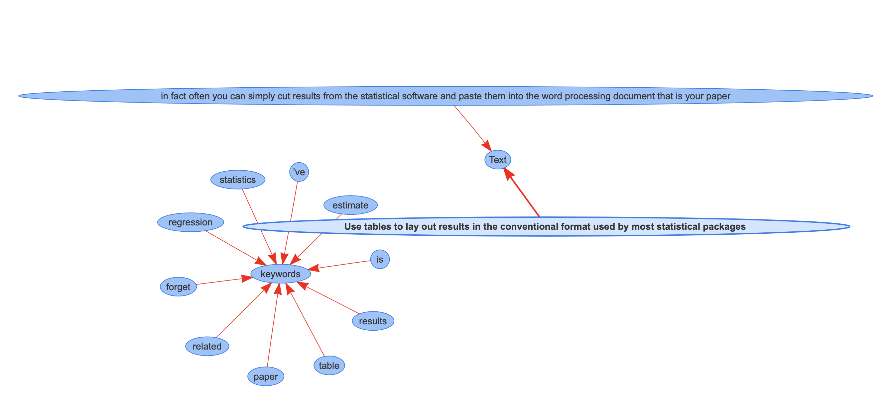
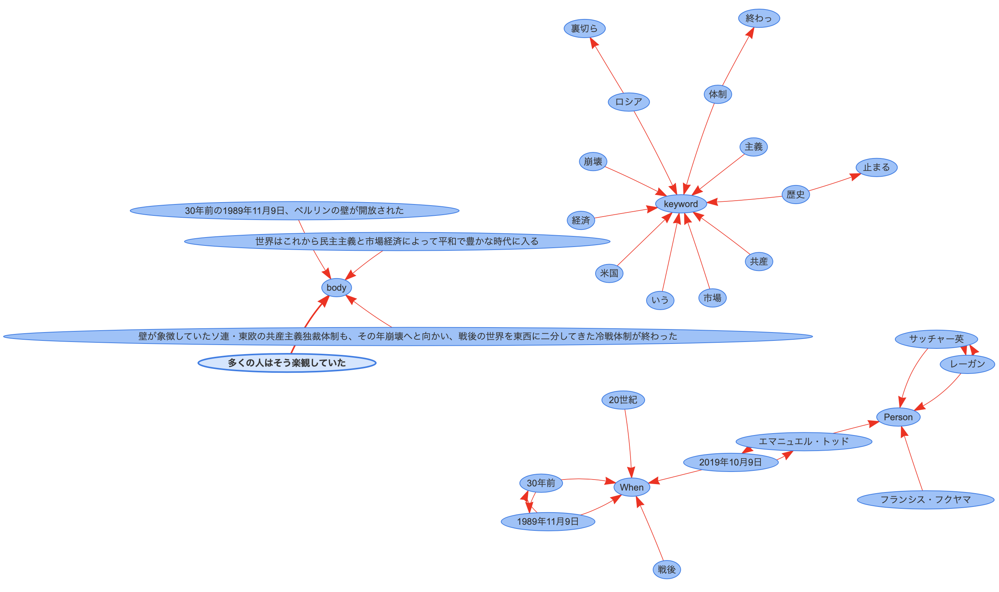

# Summarizer

  
  

This is a .net Framework based automation tool for summarization built using RPA developing software UiPath. It utilizes textrank and nod2vec algorithms to summarize and visualize text as clipboard-copied, document or emails. The activity is composed by three parts:

  

* Installer: One time installation of python runtime and dependencies necessary to run the activity.

* User Interface: HTML Custom Input interface to retrieve user options: mode, graphic visualization and Google Translate.

* Processing: Python code retrieves and processes input text. Outputs are saved either as report (.docx) and/or graphic display (.html) of key concepts at output folder.

  

It generates summarized text report of three types of input: Clipboard, Document and Email. Allows visualization of key concepts and relations from the targeted inputs. Email mode allows to target folder and number of threads to be summarized.


  


  ## Getting Started

  

These instructions will get you a copy of the project up and running on your local machine for development and testing purposes. See deployment for notes on how to deploy the project on a live system.

This project can be run directly as a python activity. However, it can be run by simply cloning respository and running the xaml at UiPath Studio, the necessaries dependencies with the proper nupkg files would be placed on the dependency folder and the python runtime along with the required enviroment would be installed at the first run. On the second run onwards, this part would be skipped.


### Prerequisites

The requirements are basically,  

*  [UiPath Studio](https://www.uipath.com/) - RPA developing software

The UiPath dependencies include:

```DownloadFile: 1.1.0, UnzipProgBar: 1.2.9, Excel: 2.6.2, Mail: 1.5.1, Python: 1.1.6863.33404, WebAPI: 1.4.2, Word: 1.3.2```

among others however they are all contained at the [net452](net452) folder.

* Python environment with the following dependencies:

```
- chardet=3.0.4=py36_1003
- cryptography=2.7=py36h7a1dbc1_0
- cython-blis=0.2.4=py36hfa6e2cd_1
- ggtrans=2.4.0=py36_0
- intel-openmp=2019.4=245
- jsonschema=3.0.2=py36_0
- langdetect=1.0.7=py_0
- numpy=1.17.0=py36hc71023c_0
- openssl=1.1.1c=hfa6e2cd_0
- requests=2.22.0=py36_0
- scipy=1.3.0=py36h29ff71c_0
- spacy=2.1.7=py36he980bc4_0
- sqlite=3.29.0=he774522_0
- summa=1.2.0=py36_0
- tqdm=4.32.2=py_0
- urllib3=1.24.3=py36_0
- wasabi=0.2.2=py_0
- wheel=0.33.4=py36_0

- pip:
-- en-core-web-sm==2.1.0
-- ginza==2.0.0
-- ja-ginza==2.1.0
-- sortedcontainers==2.1.0
-- sudachidict-core==20190531
-- sudachipy==0.3.3
```

For the complete list of dependencies refer to *miniconda.yml* file.


> **Note:** The *wasabi* dependencies *ginza and ja-ginza modules* are not necessary but required if you are to interested in Japanese language compatibility, whereas [*SpaCy*](https://github.com/explosion/spaCy) and the *en-core-web-sm* module are required for English.
  

### Config

The default settings will taken from settings panel and stored at the following [Config.xlsx](text_summary/Config/Config.xlsx) file. The can be however changed at any time.

|                 |VALUE                          |
|-----------------|-------------------------------|
|SavePath         |`'Output/'`                    |
|summaryRatio     | 0.3 - default                 |
|sumWordLength    |`Disabled`                     |
|AnacondaPath     |`Path` default: proj. folder   |
|EmailWordCount   | 0 - default                   |
|-----------------|-------------------------------|
|DocumentSavePath |`Choose Path`                  |
|EmailAddress     |`Email` only Outlook compat.   |
|TargetFolder     |`e.g. Inbox, Archive...`       |
|NumberOfEmails   | example: 3                    |


## Deployment
  

To run it on another windows machine you can pack the python runtime and enviroment with the requirements especified at [miniconda.yml](miniconda.yml) with:

  

*  [Conda-Pack](https://conda.github.io/conda-pack/)
*  [Embedded Python](https://docs.python.org/3/extending/embedding.html)

  

> **Note:** The main xaml of this project has a *installer* section. Therefore the xaml can be runned and work out-of-the-box, downloading the packed environment and runtime (only on the first run).

  
  
## Sample Input and Outputs
  
  
As the main xaml file is runned, the user is prompt to choose modes at the [settings_panel.html](text_summary/HTML/settings_panel.html) file : clipboard, e-mail, document: (pdf, docx, txt) and set values which will also be set as defaults at the [Config.xlsx](text_summary/Config/Config.xlsx) referred above


In the Visualization mode would provide two outputs as well a summarized text and a html file with main concepts and their relations as shown the following graph



In Japanese the outputs are the same. This time the sample input corresponds to a news web article



There is also the option to translated cross-language.

> **Note:** The main xaml of this project has a *installer* section. Therefore the xaml can be runned and work out-of-the-box, downloading the packed environment and runtime (only on the first run).

## Authors

  

*  **Pablo Morales** - [pdmorale](https://github.com/pdmorale)

  

## License

  

This project is licensed under the MIT License - see the [LICENSE.md](LICENSE.md) file for details
